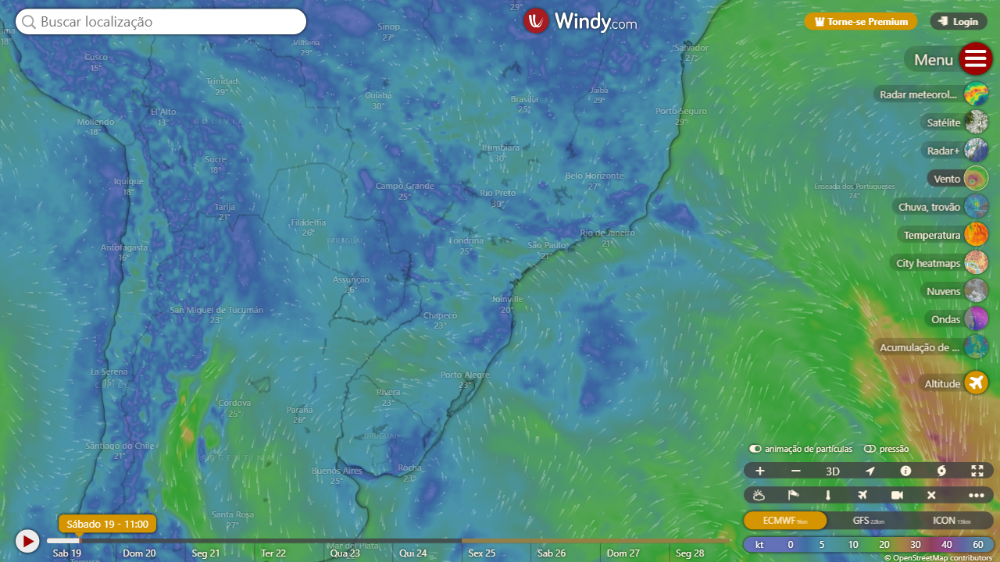

# Playwright com Java

## Exemplo práticos simples de uso do Playwright utilizando Java

- Exemplo 1: Acessar o site do G1 e preencher a barra de pesquisa. Caso existam resultados, tirar print da tela;
- Exemplo 2: Acessar o Google, preencher a barra de pesquisa e entrar no primeiro resultado.
- Exemplo 3: Definir a geolocalização do navegador para Joinville - SC, acessar o Windy e tirar um print da tela.

## Resultados
### Exemplo 1:

### Exemplo 2:

### Exemplo 3:

## Tecnologias
- Java 21 LTS
- Playwright